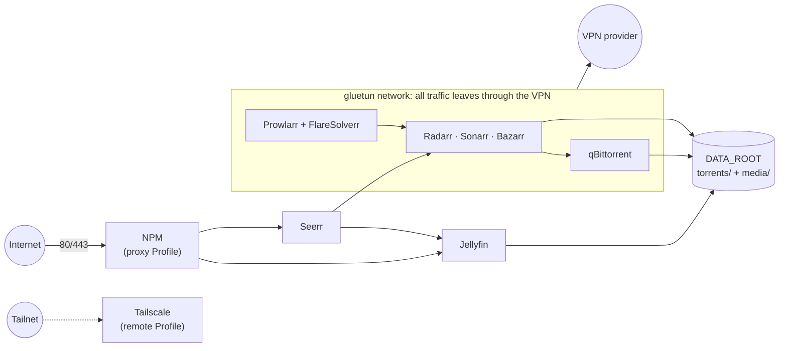

# media-stack

[Español](README.md)

A self-hosted media server (download automation, requests, playback) as a Docker
Compose Template you can deploy on any Linux machine with Docker.

## Architecture



Services behind the VPN share gluetun's network: if the VPN drops, they have no network
at all. Jellyfin and Seerr run outside it, so Viewers stream at full speed.

## Core

Every Instance runs these services:

| Service | Role | Port | Behind the VPN |
| --- | --- | --- | --- |
| gluetun | VPN gateway (any provider gluetun supports) | — | — |
| qBittorrent | Torrent client | 8080 | yes |
| Prowlarr | Indexer manager | 9696 | yes |
| FlareSolverr | Cloudflare solver for Prowlarr (`http://localhost:8191`) | — | yes |
| Radarr | Movies | 7878 | yes |
| Sonarr | Series | 8989 | yes |
| Bazarr | Subtitles | 6767 | yes |
| Jellyfin | Media server | 8096 | no |
| Seerr | Request portal | 5055 | no |

## Profiles

Optional groups of services on top of the Core, turned on with `COMPOSE_PROFILES` in
`.env` (comma separated). Setup for each: [docs/profiles.md](docs/profiles.md).

| Profile | What it adds |
| --- | --- |
| `backup` | Nightly encrypted copy of the App data to Google Drive, with restore. See [docs/backup.en.md](docs/backup.en.md). |
| `vo` | A second Radarr and Sonarr for an original-version library. |
| `jackett` | Jackett, as a Torznab bridge for indexers Prowlarr lacks. |
| `seeding` | qui (qBittorrent web UI) and cleanuparr (download cleanup). |
| `cleanup` | Maintainerr: removes library items by rules. |
| `dashboard` | Homarr (start page) and Dockge (compose UI). |
| `monitoring` | Beszel (metrics and alerts) and What's Up Docker (image updates). |
| `proxy` | Nginx Proxy Manager, to publish Jellyfin and Seerr (and, carefully, some Operator apps) on the internet. See [docs/security.en.md](docs/security.en.md). |
| `remote` | Tailscale, with the LAN as an optional subnet route. |
| `extras` | issue-automator (acts on Seerr issues), mousehole, a Tor proxy and File Browser. |
| `transcode` | Tdarr server, for a Worker with a GPU to re-encode large files that are no longer seeding. See [docs/transcode.md](docs/transcode.md). |

Hardware transcoding with the host's GPU (`/dev/dri`) for Jellyfin and Tdarr is an
override, `compose.gpu.yaml`, turned on with `COMPOSE_FILE` in `.env`.

## Quickstart

Requirements: **Linux**, Docker Engine with Compose 2.20 or newer, Python 3.7 or newer, `/dev/net/tun`, and a
VPN account. Windows and macOS are not supported.

```sh
git clone https://github.com/alberba/media-stack.git && cd media-stack
scripts/setup.sh && docker compose up -d && scripts/verify.sh
```

## Guides

1. [Install](docs/install.en.md): requirements, the wizard, first start, troubleshooting.
2. [Wiring the apps](docs/wiring.en.md): what the `wire` container connects on its own,
   what is left to you, the `/data` layout and hardlinks.
3. [Security checklist](docs/security.en.md): what to expose, Access Lists, Tailscale.
4. [Profiles](docs/profiles.md), [backup and restore](docs/backup.en.md),
   [transcoding](docs/transcode.md), [Jellyfin customizations](docs/jellyfin-customizations.md) (optional).

## Layout

```
compose.yaml            includes every stack
compose.gpu.yaml        optional override: host GPU for Jellyfin and Tdarr
stacks/<stack>/         one compose file per stack (Core or Profile)
worker/                 Tdarr node for a Linux Worker, and the Windows node's config
scripts/setup.sh        interactive wizard that writes .env
scripts/init.sh         host checks + folders + network
scripts/verify.sh       post-start health and VPN check
docs/                   guides (install, wiring, security, Profiles, backup, transcoding)
.env.example            every setting, commented
```

## Contributing

Nothing specific to an Instance may be committed (see `docs/adr/0001`). The
`.gitignore` is a whitelist, and gitleaks scans every commit and every push.

```sh
git config core.hooksPath .githooks   # gitleaks pre-commit hook (gitleaks or Docker)
tests/template.test.sh && tests/init.test.sh && tests/verify.test.sh && tests/hooks.test.sh
tests/topology.test.sh && tests/wire.test.sh   # endpoint resolution and app connections
tests/issue-automator.test.sh && tests/tdarr-plugin.test.sh   # need python3, and node or Docker
tests/backup.test.sh && tests/backup-image.test.sh   # needs sqlite3 and Docker
```

Image versions are pinned; [Renovate](https://github.com/apps/renovate) opens PRs to bump
them.

## License

MIT

## Upgrading

Instances follow versioned Template releases. See [releases and upgrades](docs/upgrading.md):
`scripts/upgrade.sh --dry-run` shows changes, `sudo scripts/upgrade.sh` applies the
latest release and `sudo scripts/upgrade.sh --rollback` restores previous code and
images. Renovate bumps images on main for maintainers; What's Up Docker
(the monitoring Profile) only reports upstream image updates.
