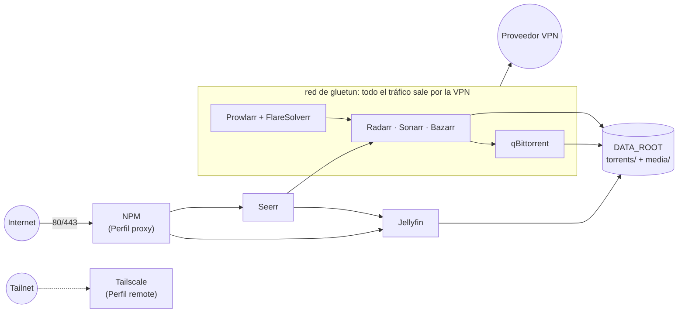

# media-stack

[English](README.en.md)

Un servidor multimedia autoalojado (descargas automáticas, peticiones y reproducción)
como Plantilla de Docker Compose que puedes desplegar en cualquier máquina Linux con Docker.

## Arquitectura



Los servicios de detrás de la VPN comparten la red de gluetun: si la VPN cae, se quedan
sin red. Jellyfin y Seerr van fuera, así que los Espectadores ven el contenido a toda velocidad.

## Núcleo

Toda Instancia ejecuta estos servicios:

| Servicio | Función | Puerto | Tras la VPN |
| --- | --- | --- | --- |
| gluetun | Pasarela VPN (cualquier proveedor que soporte gluetun) | — | — |
| qBittorrent | Cliente de torrents | 8080 | sí |
| Prowlarr | Gestor de indexers | 9696 | sí |
| FlareSolverr | Resuelve Cloudflare para Prowlarr (`http://localhost:8191`) | — | sí |
| Radarr | Películas | 7878 | sí |
| Sonarr | Series | 8989 | sí |
| Bazarr | Subtítulos | 6767 | sí |
| Jellyfin | Servidor multimedia | 8096 | no |
| Seerr | Portal de peticiones | 5055 | no |

## Perfiles

Grupos opcionales de servicios sobre el Núcleo, que se activan con `COMPOSE_PROFILES` en
`.env` (separados por comas). Configuración de cada uno: [docs/profiles.md](docs/profiles.md) (solo en inglés).

| Perfil | Qué añade |
| --- | --- |
| `backup` | Copia cifrada cada noche de los Datos de las apps a Google Drive, con restauración. Ver [docs/backup.md](docs/backup.md). |
| `vo` | Un segundo Radarr y Sonarr para una Biblioteca en versión original. |
| `jackett` | Jackett, como puente Torznab para indexers que Prowlarr no tiene. |
| `seeding` | qui (interfaz web de qBittorrent) y cleanuparr (limpieza de descargas). |
| `cleanup` | Maintainerr: borra elementos de la Biblioteca según reglas. |
| `dashboard` | Homarr (página de inicio) y Dockge (interfaz para compose). |
| `monitoring` | Beszel (métricas y alertas) y What's Up Docker (actualizaciones de imágenes). |
| `proxy` | Nginx Proxy Manager, para publicar Jellyfin y Seerr (y, con cuidado, algunas apps del Operador) en internet. Ver [docs/security.md](docs/security.md). |
| `remote` | Tailscale, con la LAN como ruta de subred opcional. |
| `extras` | issue-automator (actúa sobre las incidencias de Seerr), mousehole, un proxy Tor y File Browser. |
| `transcode` | Servidor Tdarr, para que un Worker con GPU recodifique ficheros grandes que ya no se comparten. Ver [docs/transcode.md](docs/transcode.md) (solo en inglés). |

La transcodificación por hardware con la GPU del host (`/dev/dri`) para Jellyfin y Tdarr
es un override, `compose.gpu.yaml`, que se activa con `COMPOSE_FILE` en `.env`.

## Inicio rápido

Requisitos: **Linux**, Docker Engine con Compose 2.20 o superior, Python 3.7 o superior, `/dev/net/tun` y una
cuenta de VPN. Windows y macOS no están soportados.

```sh
git clone https://github.com/alberba/media-stack.git && cd media-stack
scripts/setup.sh && docker compose up -d && scripts/verify.sh
```

## Guías

1. [Instalación](docs/install.md): requisitos, el asistente, primer arranque y problemas frecuentes.
2. [Conectar las apps](docs/wiring.md): lo que el contenedor `wire` conecta solo, lo que
   queda a mano, la estructura de `/data` y los hardlinks.
3. [Checklist de seguridad](docs/security.md): qué exponer, Access Lists y Tailscale.
4. [Copia de seguridad y restauración](docs/backup.md). Solo en inglés:
   [Perfiles](docs/profiles.md), [transcodificación](docs/transcode.md) y
   [personalizaciones de Jellyfin](docs/jellyfin-customizations.md) (opcional).

## Estructura

```
compose.yaml            incluye todos los stacks
compose.gpu.yaml        override opcional: GPU del host para Jellyfin y Tdarr
stacks/<stack>/         un compose por stack (Núcleo o Perfil)
worker/                 nodo Tdarr para un Worker Linux, y la config del nodo Windows
scripts/setup.sh        asistente interactivo que escribe .env
scripts/init.sh         validación del .env + comprobaciones del host + carpetas + red
env/catalog.json        contrato de variables de la Instancia y el Worker
scripts/env_contract.py lectura con Compose, validación y generación de ejemplos
scripts/verify.sh       comprobación de salud y de la VPN tras arrancar
docs/                   guías (.md en español, .en.md en inglés)
.env.example            todos los ajustes, comentados
```

## Contribuir

No se puede subir nada propio de una Instancia (ver `docs/adr/0001`). El `.gitignore` es
una lista blanca, y gitleaks revisa cada commit y cada push.

```sh
git config core.hooksPath .githooks   # hook pre-commit de gitleaks (gitleaks o Docker)
tests/template.test.sh && tests/init.test.sh && tests/verify.test.sh && tests/hooks.test.sh
tests/topology.test.sh && tests/wire.test.sh   # resolución de direcciones y conexiones entre apps
tests/issue-automator.test.sh && tests/tdarr-plugin.test.sh   # necesitan python3, y node o Docker
tests/backup.test.sh && tests/backup-image.test.sh   # necesitan sqlite3 y Docker
```

Las versiones de las imágenes están fijadas; [Renovate](https://github.com/apps/renovate)
abre PRs para subirlas.

## Licencia

MIT

## Upgrading

Las Instancias siguen releases versionadas del Template. Consulta
[releases y upgrades](docs/upgrading.md): `scripts/upgrade.sh --dry-run` muestra
los cambios; `sudo scripts/upgrade.sh` aplica la última release y
`sudo scripts/upgrade.sh --rollback` recupera el código y las imágenes anteriores.
Renovate actualiza imágenes en main para los mantenedores; What's Up Docker
(Perfil monitoring) solo avisa de actualizaciones de imágenes.
